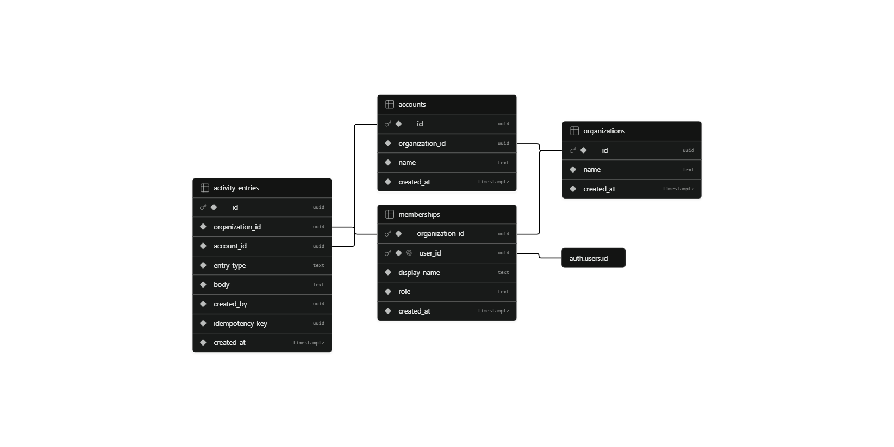

# Secure Multi-Tenant Activity Feed

A focused Next.js and Supabase vertical slice for viewing account activity and adding duplicate-safe notes. Authentication is real, and PostgreSQL Row Level Security (RLS)—not a browser-supplied tenant identifier—is the authorization boundary.

## Application overview

- [Live application](https://01-know-your-organization.vercel.app/login)
- [Loom walkthrough](https://www.loom.com/share/f44828ecc5404a47af2d202bb266009b)

## Demo credentials

Use either seeded evaluator identity on the login page. The **Quick Demo Access** tabs fill these credentials automatically.

| Organization | User | Email | Password | Visible accounts |
| --- | --- | --- | --- | --- |
| Northstar Labs | Pritam Raha | `pritam@northstar.test` | `Demo-tJY30fnfmSsYXSCK9lY4qDkW` | Acme Corporation, Globex Retail |
| Rival Systems | Alex Rival | `alex@rival.test` | `Demo-qy_NAuOb3kNPfSlQN5c-ebQk` | Rival Confidential Account |

These are throwaway assessment users intentionally documented for evaluator access. They provide only authenticated application access subject to PostgreSQL RLS; they are not Supabase administration credentials. Rotate or delete them after the evaluation.

## Completed scope

- Email/password authentication through Supabase Auth with HTTP-only session cookies.
- Two quick-select demo-user tabs that fill the corresponding email and password for the reviewer.
- Protected Next.js 16 application route using `proxy.ts` for session refresh and optimistic redirects.
- Account selection and newest-first activity feed.
- Validated note creation with database-backed idempotency.
- Loading, empty, success, validation, authorization, and server-error states.
- Two real demo identities in different organizations.
- Automated database and HTTP verification for success, retry, and cross-tenant denial.

## Architecture

```text
Browser
  -> Next.js route handlers (authenticated cookie session + Zod validation)
    -> Supabase Data API / PostgreSQL functions (user JWT)
      -> RLS membership checks + tenant-consistent foreign keys
        -> organizations / memberships / accounts / activity_entries
```

The application never accepts `organization_id` from the browser. It accepts an account UUID, then PostgreSQL resolves the account through RLS and derives both `organization_id` and `created_by` from `auth.uid()`. Normal application requests use the publishable key and the user's JWT; no service-role credential is present in the application runtime.

### Database schema

The Supabase schema connects authenticated users to tenant memberships, tenant-owned accounts, and account activity entries.



## Requirements

- Node.js 20 or newer
- npm
- A Supabase project
- Supabase CLI access for applying the migration

## Setup

1. Install dependencies:

   ```bash
   cd Frontend
   npm ci
   ```

2. Copy `.env.example` to `.env` and set:

   - `SUPABASE_URL`
   - `SUPABASE_PUBLISHABLE_KEY`
   - `SUPABASE_PROJECT_REF`
   - `SUPABASE_DB_PASSWORD`
   - `SUPABASE_ACCESS_TOKEN`

   `.env`, generated demo credentials, build output, and Supabase link metadata are excluded from Git. For a hosted evaluator deployment, also configure `DEMO_ORG_A_EMAIL`, `DEMO_ORG_A_PASSWORD`, `DEMO_ORG_B_EMAIL`, and `DEMO_ORG_B_PASSWORD` as server-side environment variables. Do not use a `NEXT_PUBLIC_` prefix. Create a new deployment after changing hosted environment variables.

3. Apply the database migration with the Supabase CLI:

   ```bash
   npx supabase link --project-ref <project-ref>
   npx supabase db push
   ```

   If a CLI release cannot parse project-link metadata, use the session-pooler connection shown by Supabase's **Connect** panel:

   ```bash
   npx supabase db push --db-url "<percent-encoded-session-pooler-url>"
   ```

4. Create two real Auth users and seed isolated demo data:

   ```bash
   npm run seed:demo
   ```

   The bootstrap uses Supabase's Auth Admin API, obtains the service key transiently through the authenticated Management API, and never writes that key to disk. On its first run, it generates random passwords and saves them to ignored `Frontend/.demo-credentials.json`; subsequent runs reuse that file. The currently seeded evaluator credentials are documented above. If the ignored file is deleted before reseeding, use the newly generated values from that file and update the hosted demo environment variables. The login page loads complete server-side demo environment variables first and uses the ignored file only when none of the four variables are configured. A partial environment configuration fails closed and disables the tabs. The page exposes these two throwaway identities to the browser solely for the requested one-click evaluator workflow; this convenience must not be enabled for production identities.

5. Start the application:

   ```bash
   npm run dev
   ```

   Open `http://localhost:3000` and sign in with either documented demo identity. If the project was reseeded after deleting `.demo-credentials.json`, use the newly generated values in that file instead.

## API operations

| Operation | Route | Behavior |
| --- | --- | --- |
| Sign in | `POST /api/auth/login` | Validates credentials and establishes the Supabase cookie session. |
| Sign out | `DELETE /api/auth/logout` | Revokes the current session and clears cookies. |
| Workspace | `GET /api/workspace` | Returns only the authenticated membership and its accounts. |
| Read activity | `GET /api/accounts/:accountId/activities` | Returns accessible notes newest first. |
| Create note | `POST /api/accounts/:accountId/activities` | Validates body/key and creates or returns the idempotent result. |

An inaccessible account and a nonexistent account return the same response to avoid account enumeration.

## Data and tenancy model

- `organizations`: tenant root.
- `memberships`: maps `auth.users.id` to one organization for this intentionally small slice.
- `accounts`: carries the owning organization.
- `activity_entries`: carries organization, account, author, note body, timestamp, and idempotency key.

All tenant tables have RLS enabled. Composite foreign keys require an activity's organization to match both its account and author membership. Insert column grants prevent callers from setting organization, author, or timestamp. A trigger derives tenant and author, while a unique `(organization_id, idempotency_key)` constraint makes concurrent retries duplicate-safe.

The one-organization-per-user constraint is deliberate. Supporting users in multiple tenants would require an explicit active-organization selector and a signed/server-maintained tenant context; silently choosing one would be unsafe.

## Verification

Static checks:

```bash
npm run typecheck
npm run lint
npm run verify:client
npm run build
```

Live database/RLS verification:

```bash
npm run verify:integration
```

End-to-end route verification (with the app running on port 3100):

```powershell
npm run build
npm run start -- -p 3100
$env:TEST_BASE_URL = "http://127.0.0.1:3100"
npm run verify:http
```

Real-browser LAN verification using an installed Edge/Chrome browser:

```powershell
npm run verify:browser:lan
```

Observed evidence on 2026-08-08:

| Check | Result |
| --- | --- |
| Demo identity selectors | Both organization tabs rendered |
| Native and insecure-origin idempotency UUID paths | Passed |
| Real browser at `http://192.168.0.111:3000` | Login, Globex create, visible success, cleared form and one rendered note passed |
| Unauthenticated workspace | HTTP `401` |
| Authenticated activity read | HTTP `200` |
| First create | HTTP `201` |
| Identical retry | HTTP `200`, same entry ID, `wasDuplicate: true` |
| Tenant A reads tenant B account | HTTP `403`; PostgreSQL `42501` directly |
| Tenant A writes tenant B account | HTTP `403`; PostgreSQL `42501` directly |
| Database lint | No findings |
| TypeScript / ESLint / production build | Passed |

## Production monitoring

One important failure mode is an unexpected rise in authorization denials caused by a broken membership sync, expired sessions, or attempted account-ID tampering. I would emit structured route metrics for `401`, `403`, and database code `42501`, grouped by route and deployment version, while excluding note bodies, access tokens, raw cookies, and idempotency keys. An alert on a sustained increase in the denial ratio—paired with Supabase Auth and PostgreSQL logs—would distinguish a release regression from hostile traffic.

## Timebox and trade-offs

Implementation began at **2026-08-08 12:40:21 IST**. The required vertical slice, submission artifacts, requested local demo-login enhancement, LAN-origin correction, and real-browser regression test were completed at **13:38:26 IST** (58 minutes), inside the two-hour limit. A separately recorded post-timebox correction at **15:14 IST** added hosted environment-variable support after the Vercel deployment exposed the local-file assumption. Time was prioritized toward database enforcement and evidence rather than unrelated features or visual polish.

Not included: pagination, tenant switching, role administration, password recovery, CI deployment, screenshots, and production telemetry wiring. These are intentionally outside the requested slice. With another two hours, I would add broader Playwright browser coverage, generated Supabase TypeScript types, pagination, request correlation IDs, and CI checks.

See [REPORT.md](REPORT.md), [AI_USAGE.md](AI_USAGE.md), and [TODO.md](TODO.md) for the assessment summary, AI audit trail, and completion checklist.
